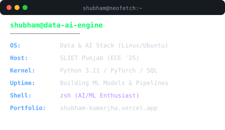

  

  
  &nbsp;
  
  &nbsp;
  

---

### 💻 SYSTEM TERMINAL & SELF-TYPING PROFILE

  
  

---

### 🟢 LIVE MATRIX CONTRIBUTION GRAPH

  

---

### 🛠️ TECH STACK & ARCHITECTURE

| Domain | Core Technologies & Tools |
| :--- | :--- |
| **Languages** | `Python` `JavaScript` `SQL` `HTML5` `CSS3` |
| **AI / Data Science** | `PostgreSQL` `Pandas` `NumPy` `Scikit-Learn` `PyTorch` `TensorFlow` |
| **Tools & Platforms** | `Git` `VS Code` `Vercel` `Linux Environment` |

---

### 📊 REAL-TIME METRICS & ANALYTICS

  
  

