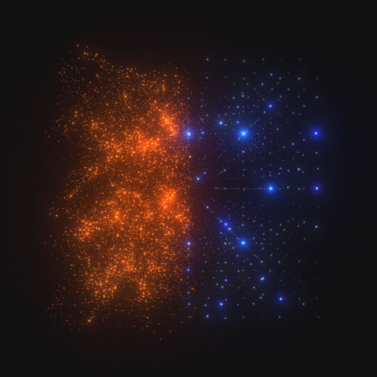

<!-- <div align="center">

  <!-- Local GIF Header Banner -->
  

  <br/><br/>

  <!-- Animated Typing Subtitle -->
  <a href="https://git.io/typing-svg">
    
  </a>

  <br/><br/>

  <!-- Badges -->
  <a href="https://www.linkedin.com/in/shubham-kumar-jha-ab56b5217/">
    
  </a>
  &nbsp;
  <a href="https://shubham-kumarjha-portfolio-portfolio.vercel.app">
    
  </a>
  &nbsp;
  <a href="mailto:shubhamwhapp1@gmail.com">
    
  </a>

  <br/><br/>

  <!-- Views Counter -->
  

</div>

---

### 🚀 About Me

- 🎓 **Education:** B.Tech in Electronics & Communication Engineering (SLIET Punjab)
- 🔬 **Focus Areas:** Data Science, Machine Learning, Deep Learning Pipelines & Database Architecture
- 🌐 **Portfolio Website:** [shubham-kumarjha-portfolio-portfolio.vercel.app](https://shubham-kumarjha-portfolio-portfolio.vercel.app)
- 💼 **LinkedIn Profile:** [shubham-kumar-jha-ab56b5217](https://www.linkedin.com/in/shubham-kumar-jha-ab56b5217/)
- ⚡ **Goal:** Building production-grade AI/ML models & data-driven software solutions

---

### 🛠️ Languages, Frameworks & Tools

#### 🐍 Languages & Core Web
<p align="left">
   &nbsp;&nbsp;
   &nbsp;&nbsp;
   &nbsp;&nbsp;
  
</p>

<p align="left">
  
  
  
  
</p>

#### 📊 Data Science, AI/ML & Databases
<p align="left">
   &nbsp;&nbsp;
   &nbsp;&nbsp;
   &nbsp;&nbsp;
   &nbsp;&nbsp;
   &nbsp;&nbsp;
  
</p>

<p align="left">
  
  
  
  
  
  
</p>

#### 🔧 Tools, IDEs & Deployment
<p align="left">
   &nbsp;&nbsp;
   &nbsp;&nbsp;
  
</p>

<p align="left">
  
  
  
</p>

---

### 📈 Live Contribution Graph

<p align="center">
  
</p> -->


<div align="center">

  <!-- Local GIF Banner -->
  

  <br/><br/>

  <!-- Self-Typing Subtitle -->
  <a href="https://git.io/typing-svg">
    
  </a>

  <br/><br/>

  <!-- High Quality Social Badges -->
  <a href="https://www.linkedin.com/in/shubham-kumar-jha-ab56b5217/" target="_blank">
    
  </a>
  &nbsp;
  <a href="https://shubham-kumarjha-portfolio-portfolio.vercel.app" target="_blank">
    
  </a>
  &nbsp;
  <a href="https://leetcode.com/u/shubham_kumar_jha01/" target="_blank">
    
  </a>
  &nbsp;
  <a href="mailto:shubhamwhapp1@gmail.com">
    
  </a>

</div>

---

### 👨‍💻 About Me

```yaml
Name: Shubham Kumar Jha
Degree: B.Tech in Electronics & Communication Engineering (SLIET)
Certifications: ISRO (IIRS) AI/ML for Geodata Analysis, NCC 'B' & 'C'
Current Focus: Data Science, Deep Learning Pipelines & Scalable AI Systems
Goal: Building high-impact, production-grade Machine Learning architecture
