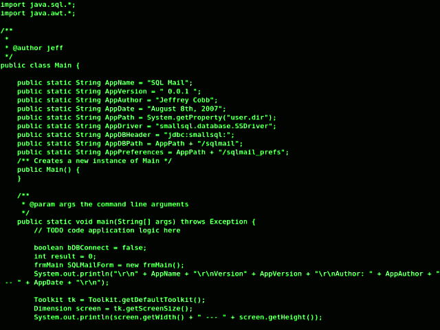

  

<h1 align="center">Hi 👋,   I'm Shubham Kumar Jha</h1>
<h3 align="center">Data & AI Engineer | Aspiring Data Scientist | Machine Learning Enthusiast</h3>

  
  &nbsp;
  

  

---

### 🚀 About Me
- 🎓 **Background:** Electronics & Communication Engineering (SLIET Punjab)
- 🔬 **Focus:** Data Science, Machine Learning, Deep Learning, & SQL Databases
- 🌐 **Portfolio Website:** [shubham-kumarjha-portfolio-portfolio.vercel.app](https://shubham-kumarjha-portfolio-portfolio.vercel.app)
- 💼 **LinkedIn:** [shubham-kumar-jha-ab56b5217](https://www.linkedin.com/in/shubham-kumar-jha-ab56b5217/)
- ⚡ **Goal:** Building impactful AI/ML models & data-driven software solutions

---

### 🛠️ Programming Languages, Data Science & Tools

#### 🐍 Programming & Core

  
  &nbsp;&nbsp;
  
  &nbsp;&nbsp;
  
  &nbsp;&nbsp;
  

#### 📊 Data Science, Machine Learning & Databases

  
  &nbsp;&nbsp;
  
  &nbsp;&nbsp;
  
  &nbsp;&nbsp;
  
  &nbsp;&nbsp;
  
  &nbsp;&nbsp;
  

#### 🔧 Tools & Deployment

  
  &nbsp;&nbsp;
  
  &nbsp;&nbsp;
  

---

### 📊 GitHub Activity & Stats

  
  

